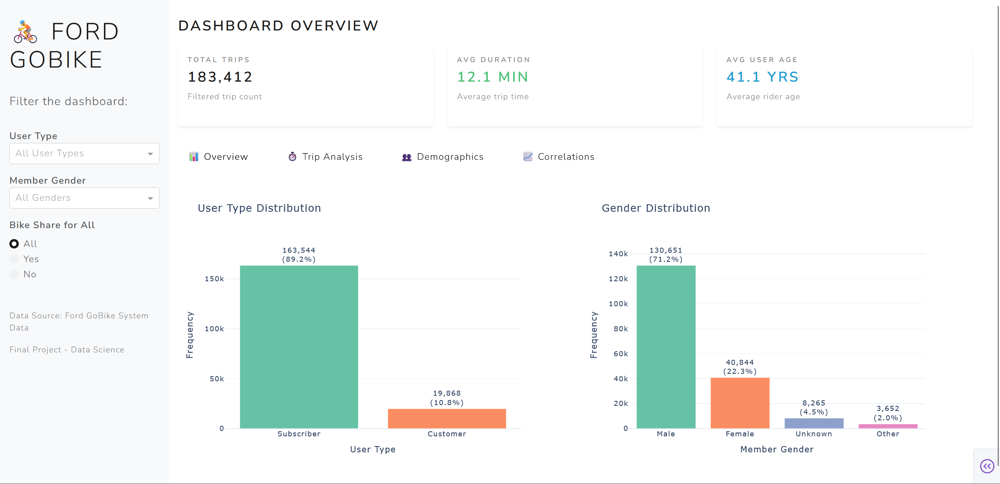
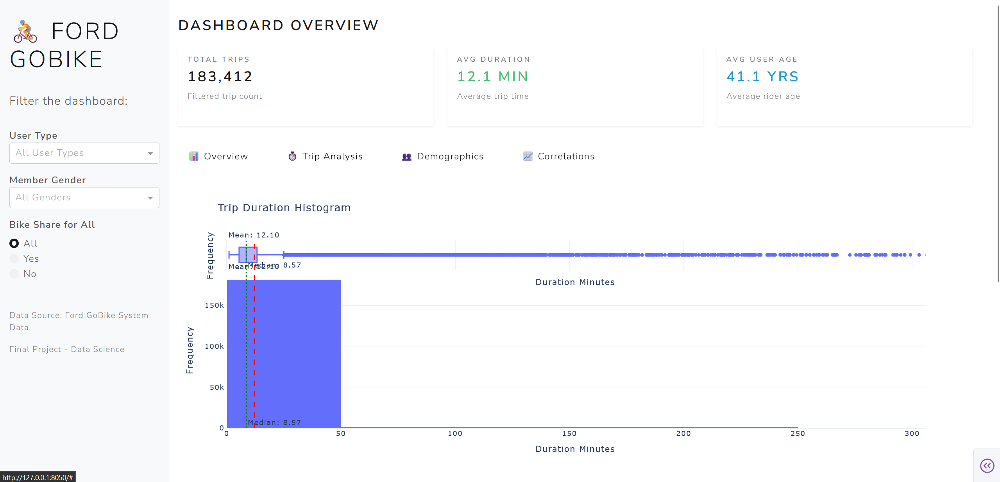
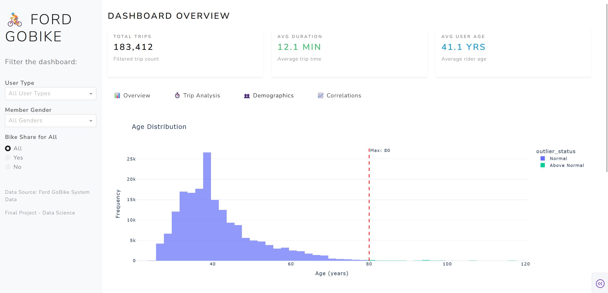
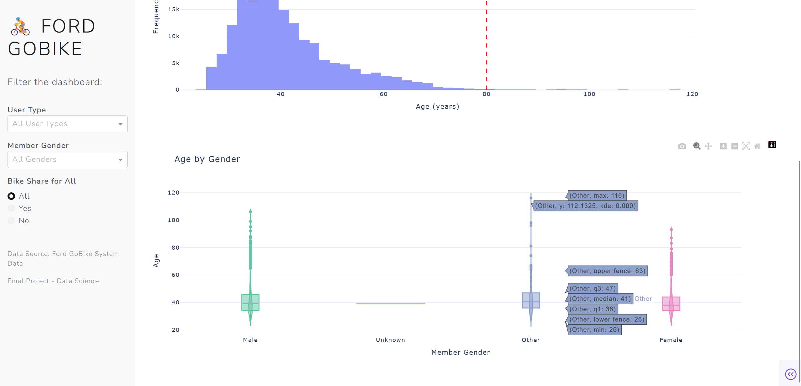
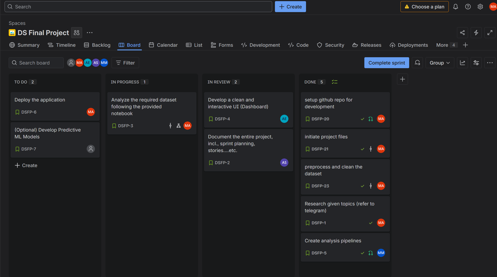

<h1 align="center">🚴‍♂️ Ford GoBike Trip Analysis — Project Documentation</h1>

<p align="center">
	
	
	
</p>

<p align="center">
	
</p>

**Overview**

This repository contains a complete data science project that analyzes Ford GoBike trip data and provides an interactive Plotly Dash dashboard for exploration and insights. The project includes data processing pipelines, EDA notebooks, and reusable `src/` utilities.

**Quick Links & Structure**

- `dash_app.py` — Main Dash application entrypoint.
- `requirements.txt` — Python dependencies.
- `data/` — Raw and processed datasets (`raw/fordgobike_raw.csv`, `processed/fordgobike_processed.csv`).
- `notebooks/` — EDA and experiment notebooks.
- `src/`, `utils/` — Modules: `eda.py`, `plotting.py`, `processing_utils.py`.
- `assets/images/` — Screenshots used in this README and demos.
- `docs/` — Project plan, user stories, and sprint notes.

**Key Features**

- ✅ Interactive dashboard with filters (date range, station, user type)
- ✅ Preprocessing pipeline to produce `data/processed/fordgobike_processed.csv`
- ✅ EDA notebooks and exportable figures for reporting
- ✅ Map visualizations and time-series analytics

---

## Screenshots — Dashboard

<p align="center">
	
	
</p>

<p align="center">
	
	
</p>

**Project Board (Jira)**

<p align="center">
	
</p>

---

## Getting started (local)

1. Create a virtual environment and install dependencies:

```powershell
python -m venv .venv
.\.venv\Scripts\Activate.ps1
pip install -r requirements.txt
```

2. Start the Dash app:

```powershell
python dash_app.py
```

3. Open the browser at the address printed by the app (usually `http://127.0.0.1:8050`).

---

## Data & Notebooks

- Raw: `data/raw/fordgobike_raw.csv`
- Processed: `data/processed/fordgobike_processed.csv` (produced by `utils/processing_utils.py`)
- Notebooks: `notebooks/` — EDA, preprocessing, model experiments

## Development notes

- Reuse functions in `src/` and `utils/` for plotting and pipeline steps.
- See `docs/project_plan.md` and `docs/user_stories.md` for scope and priorities.

---

**Contributors:** see `docs/team_roles.md`

Last updated: 2026-01-30
